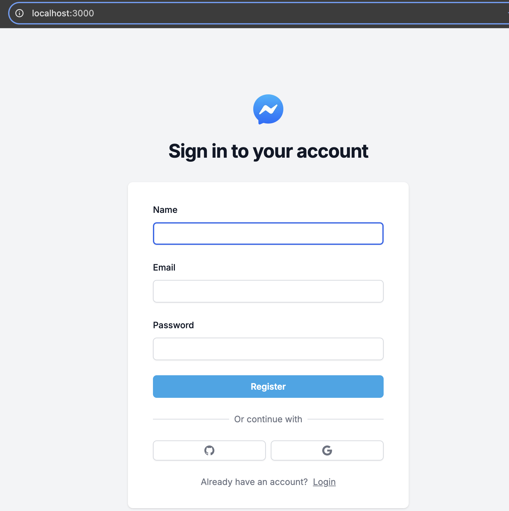
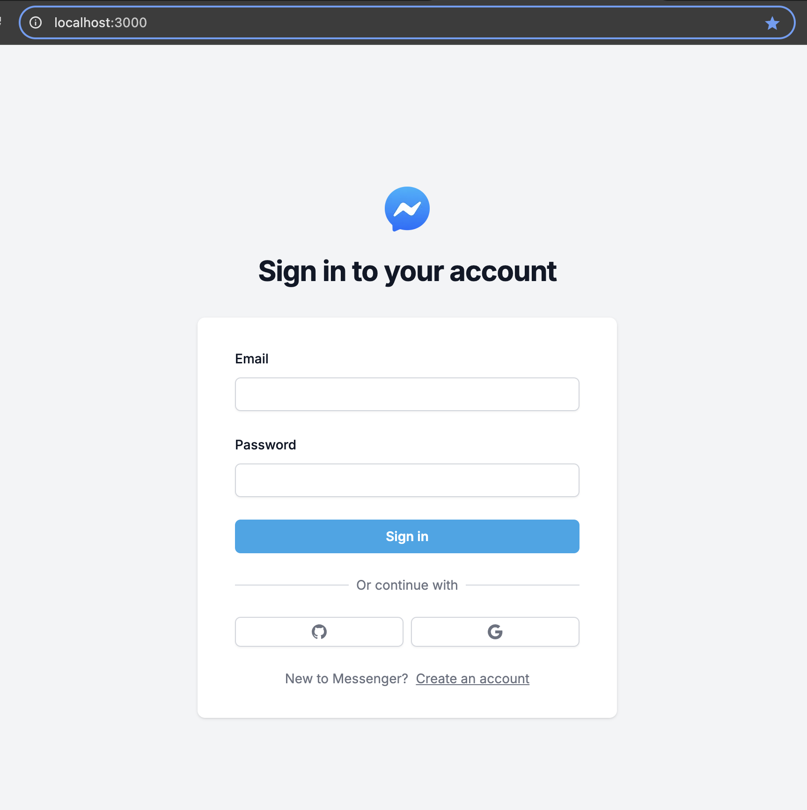
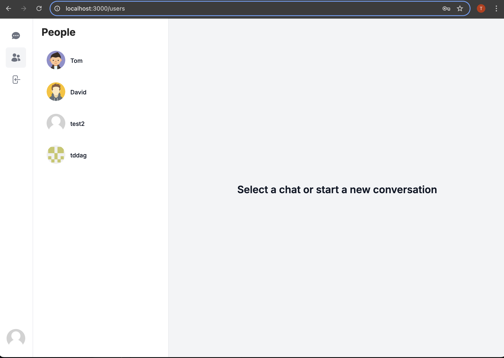
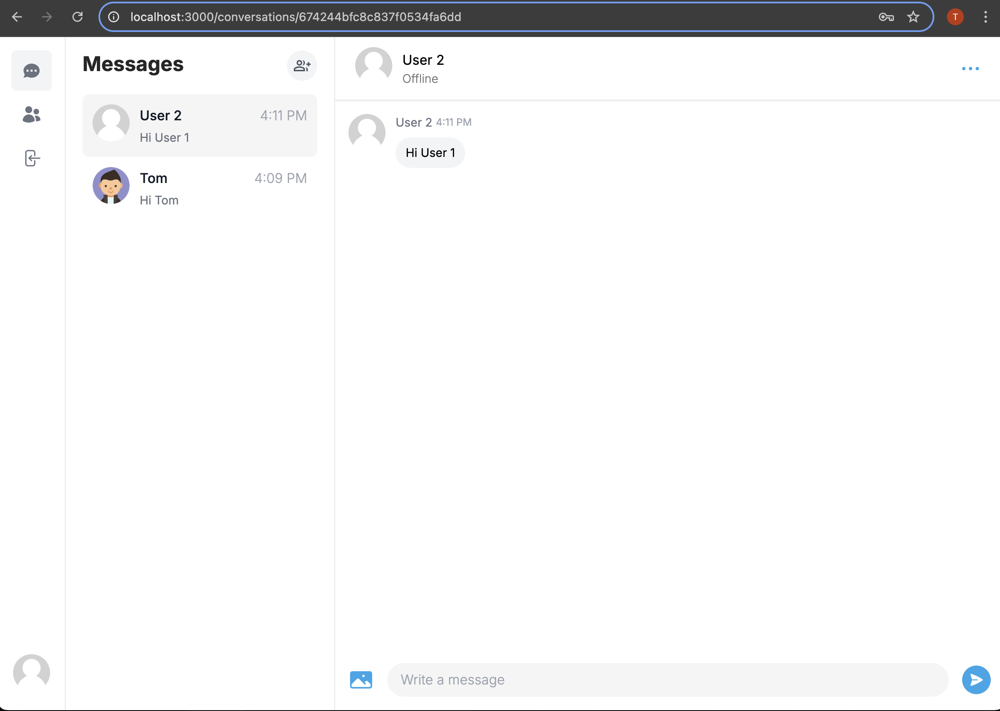
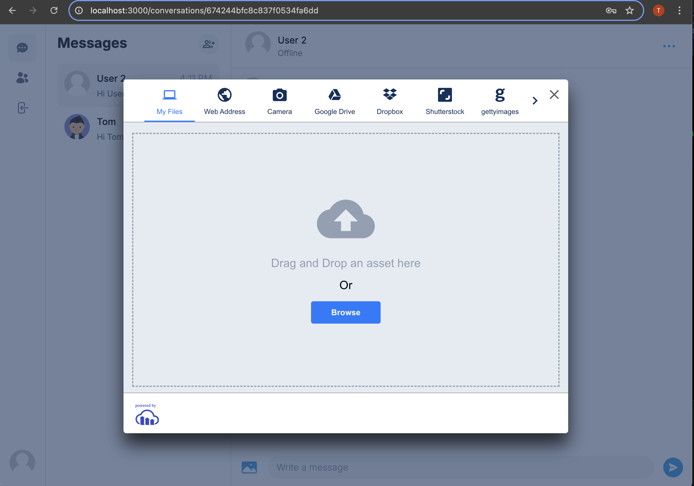
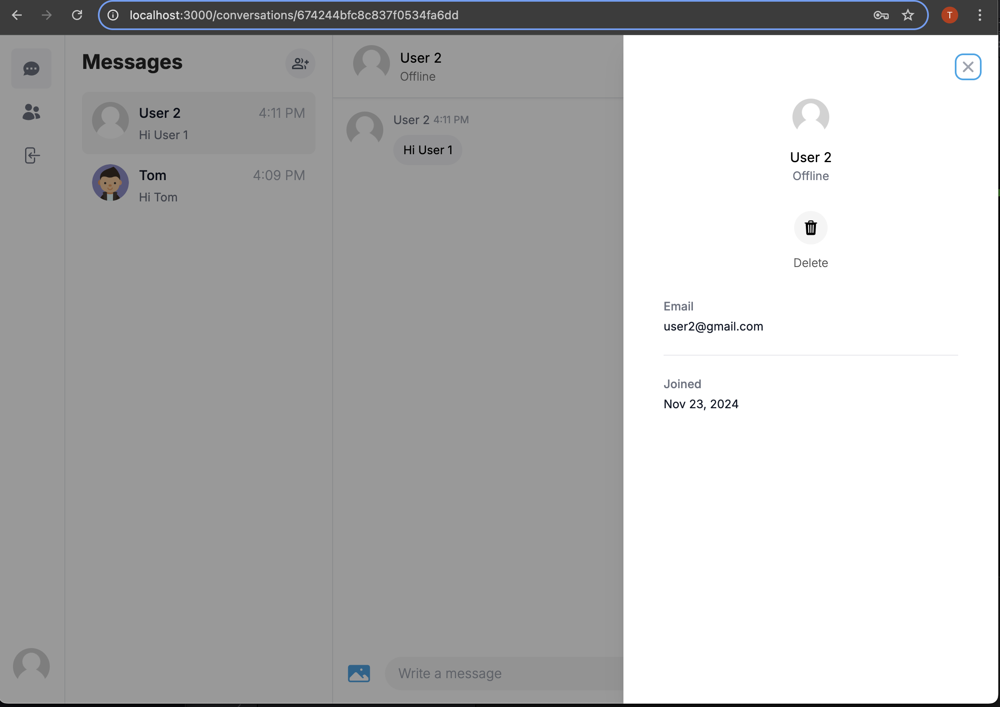
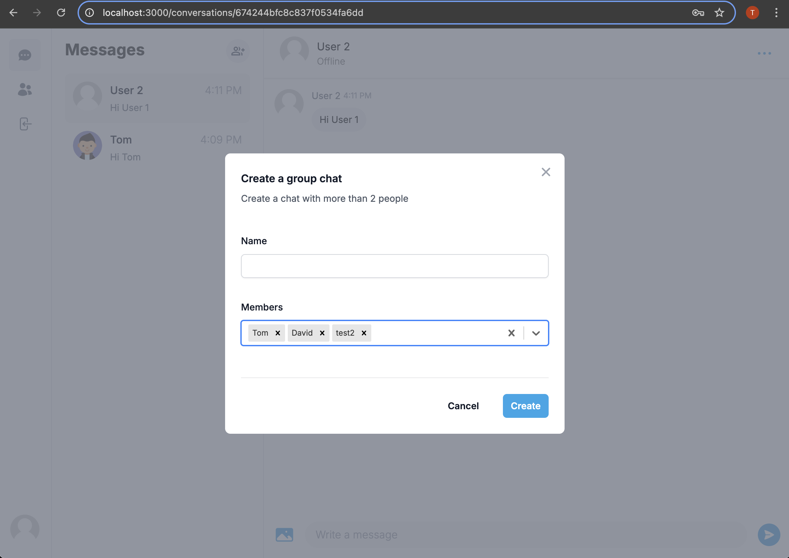
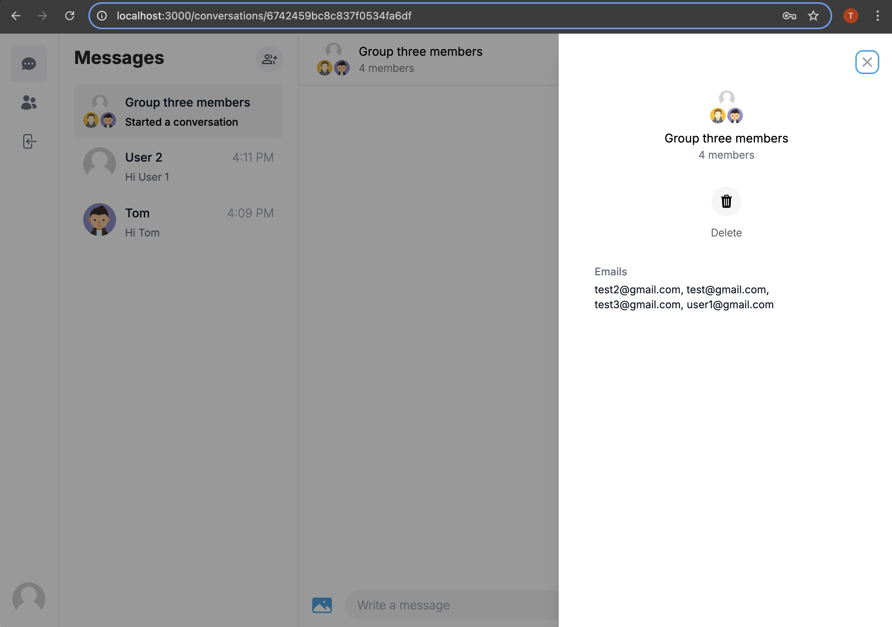
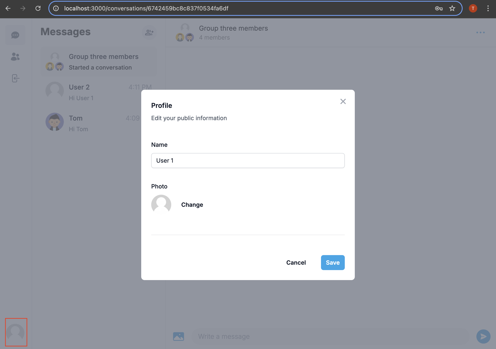
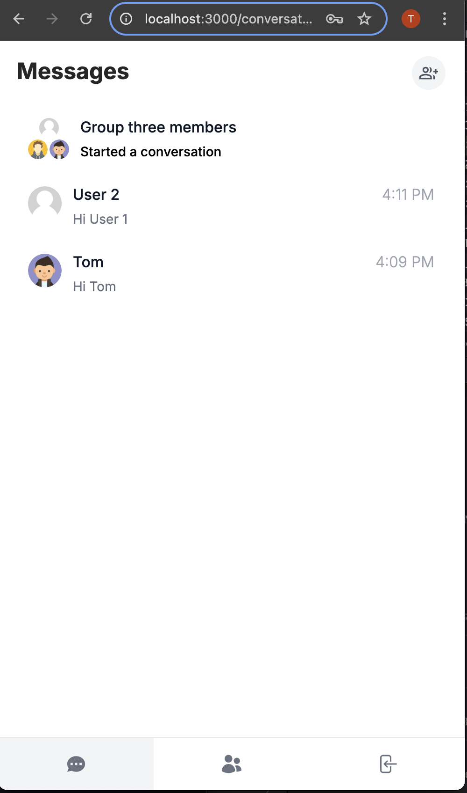

### Live Demo 

https://td-messenger-clone-app.vercel.app/


# Setup 
- Install [Node](https://nodejs.org/en/download/)
- Install [Git](https://git-scm.com/book/en/v2/Getting-Started-Installing-Git)
- Set up MongoDB
- Clone the repository `https://github.com/tddag/messenger-clone-app`
- Install dependencies `npm install`
- Set up (Pusher)[https://dashboard.pusher.com/]
    - Create a new Channel
    - Navigate to App Keys to obtain app_id, key, secret then use it to set up server environment variables
- Setup environment variables:
  - <table>
        <tr>
            <th>Variable</th>
            <th>Value</th>
            <th>Description</th>
        </tr>
        <tr>
            <td>DATABASE_URL</td>
            <td>mongodb+srv://.....</td>
            <td>MongoDB URL</td>
        </tr>
        <tr>
            <td>NEXTAUTH_SECRET</td>
            <td>.....</td>
            <td>Secret Key for Authentication</td>
        </tr>
        <tr>
            <td>GITHUB_ID</td>
            <td>3f2f8.....</td>
            <td>Github ID for Authentication</td>
        </tr>
        <tr>
            <td>GITHUB_SECRET</td>
            <td>0c60....</td>
            <td>Github Secret for Authentication</td>
        </tr>
        <tr>
            <td>GOOGLE_CLIENT_ID</td>
            <td>8459...</td>
            <td>Google Client ID for Authentication</td>
        </tr>
        <tr>
            <td>GOOGLE_CLIENT_SECRET</td>
            <td>GOCSPX-67.....</td>
            <td>Google Client Secret for Authentication</td>
        </tr>
        <tr>
            <td>NEXT_PUBLIC_CLOUDINARY_CLOUD_NAME</td>
            <td>dysns...</td>
            <td>Cloudinary name for Image/Video Storage</td>
        </tr>
        <tr>
            <td>NEXT_PUBLIC_PUSHER_APP_KEY</td>
            <td>3d6fac....</td>
            <td>Pusher App Key</td>
        </tr>
        <tr>
            <td>PUSHER_APP_ID</td>
            <td>162.....</td>
            <td>Pusher App ID</td>
        </tr>                                                                
        <tr>
            <td>PUSHER_SECRET</td>
            <td>26b38.....</td>
            <td>Pusher Secret Key</td>
        </tr>                      
    </table>


# Functionalities
- User Authentication, Google/Github Authentication
  - <table>
        <tr>
            <td></td>
            <td></td>
        </tr>
    </table>
- User listing
  - <table>
        <tr>
            <td></td>
        </tr>
    </table>
- Real time messages, send images, delete conversation
  - <table>
        <tr>
            <td></td>
            <td></td>
            <td></td>
        </tr>
    </table>
- Group Chat
  - <table>
        <tr>
            <td></td>
            <td></td>
        </tr>
    </table>   
- Update Profile
  - <table>
        <tr>
            <td></td>
        </tr>
    </table>    
- Mobile View
  - <table>
        <tr>
            <td></td>
        </tr>
    </table>  

# Technologies/Libraries
- NextJS: Web Framework
- Pusher: real-time WebSocket-based service
- Prisma: Node.js and TypeScript ORM (Object-Relational Mapping)
- Cloudinary: Image/Video Storage
- Zustand: State Mangement library
- TailwindCSS: CSS Framework
- Typescript: static typing
- Axios: promised based HTTP client
- Bcrypt: hashing password
- clsx: conditionally joining class names into a single string
- date-fns: JS date utility library
- lodash: JS utility library
- React: Web library
- ReactHookForm: React Form Handling
- ReactHotToast: Toast notification


This is a [Next.js](https://nextjs.org/) project bootstrapped with [`create-next-app`](https://github.com/vercel/next.js/tree/canary/packages/create-next-app).

## Getting Started

First, run the development server:

```bash
npm run dev
# or
yarn dev
# or
pnpm dev
```

Open [http://localhost:3000](http://localhost:3000) with your browser to see the result.

You can start editing the page by modifying `app/page.tsx`. The page auto-updates as you edit the file.

This project uses [`next/font`](https://nextjs.org/docs/basic-features/font-optimization) to automatically optimize and load Inter, a custom Google Font.

## Learn More

To learn more about Next.js, take a look at the following resources:

- [Next.js Documentation](https://nextjs.org/docs) - learn about Next.js features and API.
- [Learn Next.js](https://nextjs.org/learn) - an interactive Next.js tutorial.

You can check out [the Next.js GitHub repository](https://github.com/vercel/next.js/) - your feedback and contributions are welcome!

## Deploy on Vercel

The easiest way to deploy your Next.js app is to use the [Vercel Platform](https://vercel.com/new?utm_medium=default-template&filter=next.js&utm_source=create-next-app&utm_campaign=create-next-app-readme) from the creators of Next.js.

Check out our [Next.js deployment documentation](https://nextjs.org/docs/deployment) for more details.
